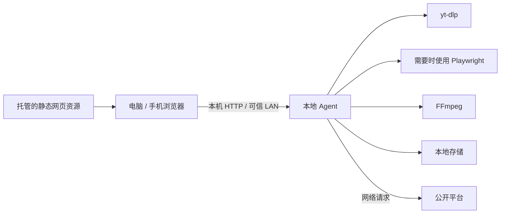

# 视频 / 图片链接解析下载工具

[English](README_EN.md) | 中文 | [License](LICENSE) | [Third-party notices](THIRD_PARTY_NOTICES.md)

[](https://github.com/win223909/local-video-image-downloader/actions/workflows/ci.yml) [](LICENSE)

[安装](#安装-python) | [架构](#架构) | [安全](SECURITY.md) | [贡献](CONTRIBUTING.md) | [许可证](LICENSE)

一个本地运行的视频、图片和图集解析下载工具。当前采用 **本地 Agent + 云端安装页** 形态：云端只托管安装入口，解析和下载都由用户电脑上的本地 Agent 完成。

## 合规说明

- 仅用于下载你有权保存的公开内容。
- 不做 VIP 破解、会员绕过、DRM 破解或付费内容破解。
- 不移除、遮盖或篡改水印、署名、版权声明、来源标识或其他权利管理信息。工具仅在平台公开返回原始资源、原图或高清资源时按用户选择保存，不承诺“去水印”。
- 不内置盗版解析接口。
- Agent 版中，网页只调用 `127.0.0.1` 或可信局域网地址上的本地助手；VPS/静态网页不保存任务 URL、解析结果、下载历史，也不传输视频文件。
- Playwright 仅用于加载公开页面、处理正常短链跳转并读取平台公开返回的资源；不使用 stealth、指纹伪装或验证码绕过逻辑。
- 支持站点以实际解析结果为准，网站规则变化时可能需要更新依赖或平台适配。
- 平台名称仅用于说明可能兼容的公开链接类型，不代表平台官方合作、认可或授权。

## 功能

- 粘贴视频、图片、图集 URL 并解析内容；抖音、小红书等平台复制出来的整段分享文案会自动提取其中的 `http(s)` 链接。
- 视频会展示标题、作者/频道、封面、时长、站点来源。
- 图片或图集会展示标题、作者/频道、图片数量和缩略图预览。
- 展示可下载格式列表：分辨率、格式、文件大小、音视频编码、是否需要合并。
- 视频可选择格式并下载到指定本地目录；图片会按标题创建文件夹并保存全部图片，保存目录支持系统文件夹选择器。
- 显示下载进度、速度和剩余时间。
- 下载完成后可打开保存目录。
- 可选择任意本地视频，或将已下载的视频在本地转换为 iPhone 相册兼容版本（H.264 + AAC）；原文件会保留，转换版保存在原文件所在文件夹，方便 AirDrop 后保存到相册。
- 开始转换时会自动暂停页面中的在线视频预览；转换只读取本地文件并由本机 FFmpeg 处理，不会把视频上传到服务器或重新从平台下载。
- 尽量自动处理平台验证和短链跳转：先用 `yt-dlp` 解析，必要时启动本机后台浏览器补强。
- 可用时优先选择平台公开返回的原始资源或高清资源；如果平台只返回带水印版本，不做算法擦除、遮盖或破解。
- Agent 版支持本机配对码：首次连接需要输入本地终端显示的 6 位配对码，连续错误尝试会短暂限流，之后 token 保存在浏览器本地。
- Agent 版支持在线更新：页面检测到新版本时可一键更新本地助手，也可运行安装包里的 `03-UPDATE` 脚本。更新包会保留 SHA256 校验，并在安全解压、替换或依赖更新失败时尝试恢复旧文件；当前尚未使用加密清单签名。

## 架构



- 托管网页提供前端页面和控制逻辑。
- 本地 Agent 执行解析、下载、转换和保存，媒体处理发生在 Agent 所在设备。
- Agent 仍然需要访问外部平台；手机可以通过可信 LAN 控制电脑或 NAS 上的 Agent。

## 安装 Python

推荐 Python 3.11 或更新版本。

macOS 可以使用 Homebrew：

```bash
brew install python
```

Windows 可以从 Python 官网下载安装：

```text
https://www.python.org/downloads/
```

安装后确认版本：

```bash
python3 --version
```

Windows 上如果没有 `python3` 命令，可以使用：

```powershell
python --version
```

## 安装 FFmpeg

FFmpeg 用于合并视频和音频。很多高质量格式会把视频和音频分开提供，因此建议安装。

macOS：

```bash
brew install ffmpeg
```

Windows 推荐使用 winget：

```powershell
winget install Gyan.FFmpeg
```

也可以从 FFmpeg 官网下载：

```text
https://ffmpeg.org/download.html
```

确认安装：

```bash
ffmpeg -version
ffprobe -version
```

## 安装依赖

开发或手动运行 Agent 时，在项目目录执行：

```bash
python3 -m venv .venv
source .venv/bin/activate
pip install -r requirements.txt
python -m playwright install chromium
```

Windows PowerShell：

```powershell
python -m venv .venv
.\.venv\Scripts\Activate.ps1
pip install -r requirements.txt
python -m playwright install chromium
```

## 运行方式：本地 Agent + 自托管安装页

这个模式适合把 `web/` 静态页面部署到任意静态托管环境，例如 GitHub Pages、Cloudflare Pages、VPS、NAS + nginx/Caddy。实际解析和下载仍然在用户电脑或 NAS 上的本地 Agent 完成。

项目默认不依赖固定域名或固定服务器：

- 静态页默认从同站点的 `./downloads/` 下载安装包。
- 如果部署者额外提供 `/api/download-link` 防刷接口，页面会优先使用该接口；接口不可用时自动回退到安装包直链。
- 更新清单默认在 `web/downloads/update.json`，安装包构建时可通过 `PUBLIC_BASE_URL` 写入自己的线上更新地址。
- 本地 Agent 默认只信任本机开发地址；构建安装包时如果设置了 `PUBLIC_BASE_URL`，安装器会把该站点写入本地 Agent 的允许来源。

### 给普通用户安装

安装页会根据用户系统显示安装入口：

- macOS：下载 `VideoDownloaderAgent-macOS.zip`，解压后双击 `01-INSTALL.command` 安装。如果显示“已阻止 01-INSTALL.command 以保护 Mac”或“Apple 无法验证”，不要点击“移到废纸篓”；打开“系统设置 → 隐私与安全性”，在安全性提示中点击“仍要打开”，再确认打开。需要更新时双击 `03-UPDATE.command`，需要重置或卸载时双击 `02-UNINSTALL.command`。
- Windows：下载 `VideoDownloaderAgent-Windows.zip`，先右键选择“全部解压缩”，打开解压后的文件夹，再双击 `01-INSTALL.bat` 安装；需要更新时双击 `03-UPDATE.bat`，需要重置或卸载时双击 `02-UNINSTALL.bat`。如果是在 Parallels 里使用，`C:\Mac\Home\Desktop` 是 Mac 共享桌面，遇到问题时请把解压后的文件夹复制到 `C:\Users\你的Windows用户名\Desktop` 再运行。新版脚本会在失败时保留窗口，方便查看错误。
- iOS / Android：移动端浏览器不能长期运行本地 Agent，当前版本主要支持电脑使用；移动端需要后续做原生 App，或做“手机下发任务到已安装 Agent 的电脑”的多设备模式。

生成安装包：

```bash
python3 scripts/build_installers.py
```

如果你要发布到自己的域名，建议构建时指定公开访问地址：

```bash
PUBLIC_BASE_URL="https://你的域名" python3 scripts/build_installers.py
```

这样生成的安装包会记住你的站点，用于后续在线更新和浏览器到本地 Agent 的跨来源调用。如果只是本地测试或内部分发，也可以不设置 `PUBLIC_BASE_URL`，安装包仍会内置核心组件，只是在线更新会回到本机清单，不依赖外部服务器。

生成结果在 `web/downloads/`：

- `agent-source.zip`：本地 Agent 源码包，会被内置进 macOS / Windows 安装包的 `_internal/` 目录；如果用户单独缺失这个文件，安装脚本才会从线上补下载。
- `update.json`：线上更新清单，包含最新 Agent 版本、源码包地址和 SHA256 校验值。
- `VideoDownloaderAgent-macOS.zip`：macOS 一键安装包，用户只需要运行 `01-INSTALL.command`、`03-UPDATE.command` 或 `02-UNINSTALL.command`。
- `VideoDownloaderAgent-Windows.zip`：Windows 一键安装包，用户只需要运行 `01-INSTALL.bat`、`03-UPDATE.bat` 或 `02-UNINSTALL.bat`。

更新本地助手：

- 推荐方式：打开本机控制台，页面检测到新版时点击“更新本地助手”。
- 兜底方式：打开已解压的安装包文件夹，运行 `03-UPDATE` 脚本。
- 更新会从现有更新服务器下载最新 `agent-source.zip`，校验 SHA256 后安全解压，再替换本地助手代码，并执行 `pip install --upgrade -r requirements-agent.txt` 更新 `yt-dlp` 等依赖。若替换、依赖更新或后台浏览器检查失败，会尝试恢复更新前的受管文件。
- 当前更新链路仍未加入 cryptographic manifest signature；SHA256 用于校验下载包是否与现有清单一致，不等同于发布者数字签名。
- 更新会保留 `.runtime/`，也就是配对 token、保存目录、本地浏览器会话和临时状态。
- 更新不会删除用户已经下载的视频或图片。
- 只有 Python、FFmpeg 或系统环境发生大变化时，才需要重新下载安装包。

卸载本地助手：

- macOS：运行 `02-UNINSTALL.command`。
- Windows：运行 `02-UNINSTALL.bat`。
- 卸载脚本会停止本地助手、删除自启动、删除 Agent 程序目录、token、设置和临时缓存。
- 卸载脚本不会删除用户已经下载到本地的视频或图片文件。

安装脚本会在用户电脑本地创建 Python 虚拟环境、安装 Agent 依赖、设置开机自启，并把本地 token 通过 URL fragment 带回本机控制台完成连接。URL fragment 不会发送到 VPS。

面向中国网络环境的处理：

- macOS / Windows 安装包内置 `_internal/agent-source.zip`，安装时优先使用内置组件，不再二次下载核心代码。
- `pip` 默认优先使用官方 PyPI：`https://pypi.org/simple`；失败后自动尝试阿里云、清华、豆瓣镜像。可以通过环境变量 `PIP_INDEX_URLS` 覆盖完整顺序，或用 `PIP_INDEX_URL` 指定第一优先源。
- Playwright Chromium 默认优先使用官方下载源；失败后自动尝试 npmmirror：`https://npmmirror.com/mirrors/playwright`。可以通过环境变量 `PLAYWRIGHT_DOWNLOAD_HOSTS` 覆盖完整顺序，或用 `PLAYWRIGHT_DOWNLOAD_HOST` 指定镜像源。
- macOS / Windows 安装器会先检查 Python、pip、后台浏览器组件和 FFmpeg；缺失时会自动逐项安装。若网络或系统权限导致自动安装失败，仍会保留错误信息供用户截图反馈。
- 当前安装包还没有 Apple Developer 签名和 notarization，所以 macOS 可能拦截从浏览器下载的 `.command` 文件。不要关闭整台 Mac 的 Gatekeeper；按“系统设置 → 隐私与安全性 → 仍要打开”的方式只允许本次安装。彻底消除该提示需要后续做正式签名安装包。

安装完成后打开的是 `http://127.0.0.1:17890/` 本机控制台。这样页面和 Agent API 同源，可以避开 Chrome 对公网 HTTPS 页面访问本机 loopback 地址的 Local Network Access 限制。

### 1. 启动本地 Agent

```bash
source .venv/bin/activate
python -m local_agent.server
```

Windows PowerShell：

```powershell
.\.venv\Scripts\Activate.ps1
python -m local_agent.server
```

启动后终端会显示：

```text
本地下载助手已启动
访问地址：http://127.0.0.1:17890
本次配对码：123456
```

配对码 10 分钟内有效。网页第一次连接时输入一次即可。

### 2. 本地预览云端管理页

开发或本地测试时，可以直接把 `web/` 当成静态站点启动：

```bash
python3 -m http.server 8080 -d web
```

然后打开：

```text
http://127.0.0.1:8080
```

页面会自动检测 `http://127.0.0.1:17890` 上的本地 Agent。粘贴链接、解析和下载都只调用本机 Agent。安装版会优先打开 `http://127.0.0.1:17890/` 本机控制台。

### 手机控制电脑/NAS 下载

移动端第一版采用“手机控制电脑/NAS”的方式：手机不运行解析器，解析、下载、合并和保存都发生在已经启动本地助手的电脑或 NAS 上。

使用步骤：

1. 在电脑或 NAS 上启动本地助手。
2. 打开 `http://127.0.0.1:17890/` 本机控制台。
3. 展开“手机 / NAS 控制”，点击“生成手机连接信息”。
4. 手机和电脑/NAS 连接同一个网络后，在手机浏览器打开页面显示的“推荐手机打开”地址，例如 `http://192.168.1.x:17890/`。如果电脑上有虚拟网卡或 VPN，页面会尽量过滤掉这些不可从手机访问的地址。
5. 手机输入页面显示的 6 位配对码，即可粘贴链接、查看预览、发起下载。
6. 下载完成后，手机页面会显示文件列表，可点击“保存到手机”把电脑/NAS 上的文件取到手机本地；桌面端可直接点击“打开所在文件夹”查看文件。

注意：

- 这种方式不会让 VPS 中转视频或图片文件，VPS 只提供安装入口和更新清单。
- 手机必须能访问电脑/NAS 的局域网地址；如果打不开，请确认在同一个 Wi-Fi，或检查电脑系统防火墙是否允许本地助手接入。
- 如果要在外网用手机控制家里的 NAS，后续可以把 NAS Agent 接到 Cloudflare Tunnel + Access，并用 Google 登录保护入口。

### 3. 自托管部署

只需要托管 `web/` 目录里的静态文件。部署后，视频文件不会经过你的服务器，前提是用户自己的电脑或 NAS 上已经启动本地 Agent。

常见部署方式：

- GitHub Pages：把仓库推到 GitHub，发布 `web/` 目录或把 `web/` 内容放到 Pages 根目录。
- Cloudflare Pages：选择仓库，构建命令留空，输出目录填 `web`。
- VPS / NAS：用 nginx、Caddy 或任意静态文件服务托管 `web/`。

自托管发布流程：

1. 修改代码后生成安装包：

   ```bash
   PUBLIC_BASE_URL="https://你的域名" python3 scripts/build_installers.py
   ```

2. 把整个 `web/` 目录发布到你的站点。
3. 确认以下文件可访问：

   ```text
   https://你的域名/
   https://你的域名/downloads/update.json
   https://你的域名/downloads/VideoDownloaderAgent-macOS.zip
   https://你的域名/downloads/VideoDownloaderAgent-Windows.zip
   https://你的域名/downloads/agent-source.zip
   ```

4. 用户打开你的站点下载安装包。解析、下载、预览、合并和文件保存都在用户设备本地完成。

可选：安装包下载防刷

纯静态部署已经可以使用。如果你担心安装包被刷流量，可以额外部署 `server_guard/download_gate.py`，让页面请求 `/api/download-link` 生成短期下载链接。这个防刷服务是可选组件，不影响普通静态部署。

环境变量：

```bash
export VIDEO_DOWNLOADER_DOWNLOAD_SECRET="一段足够长的随机字符串"
export VIDEO_DOWNLOADER_DOWNLOAD_ROOT="/你的站点目录/downloads"
export VIDEO_DOWNLOADER_ACCESS_LOG="/你的站点目录/logs/download_gate.jsonl"
export VIDEO_DOWNLOADER_STATS_TOKEN="另一段只给管理员使用的随机字符串"
python3 server_guard/download_gate.py
```

访问日志只记录安装包下载入口事件，例如系统类型、安装包文件名、HTTP 状态、Cloudflare 国家码、浏览器 UA 和匿名化 IP 哈希；不会记录用户粘贴的视频/图片链接，也不会记录解析结果或下载文件。

查看最近 7 天统计：

```bash
curl -H "Authorization: Bearer $VIDEO_DOWNLOADER_STATS_TOKEN" \
  "https://你的域名/api/download-stats?days=7"
```

也可以打开管理员页面：

```text
https://你的域名/stats.html
```

首次打开时输入 `VIDEO_DOWNLOADER_STATS_TOKEN`。口令只保存在当前浏览器的本地存储里，不要把口令写进 `web/` 静态文件或公开仓库。统计页会显示安装包真实下载、更新包下载、下载按钮点击、被拦截请求、近似访客、按天趋势和最近事件；其中“真实下载”只统计 `GET` 请求，浏览器或系统的 `HEAD` 检测会单独显示，不计入下载量。

如果你希望统计本地助手自动更新流量，需要让 nginx/Caddy 把 `/downloads/agent-source.zip` 也转发给 `download_gate.py`，再由网关通过内部加速文件路径返回安装包；否则这个文件会作为普通静态文件提供，仍可正常更新，但不会写入统计日志。

这些限制和日志只保护安装入口流量；用户解析和下载平台视频/图片仍然发生在自己的电脑或 NAS 本地，不经过你的服务器。

手动运行 Agent 时，如果你没有用安装包写入来源站点，可以通过环境变量指定允许调用本机 Agent 的页面来源：

```bash
export LOCAL_AGENT_ALLOWED_ORIGINS="https://你的域名"
python -m local_agent.server
```

多个来源用英文逗号分隔：

```bash
export LOCAL_AGENT_ALLOWED_ORIGINS="https://你的域名,http://127.0.0.1:8080"
```

如果需要手动指定更新清单：

```bash
export LOCAL_AGENT_UPDATE_MANIFEST_URL="https://你的域名/downloads/update.json"
python -m local_agent.server
```

Agent 默认监听 `0.0.0.0:17890`，用于支持手机在同一局域网内控制电脑/NAS。所有敏感 API 都需要本机 token 或配对码。

## 更新 yt-dlp

如果是开发环境手动运行，某个平台突然解析失败，可以优先更新 `yt-dlp`：

```bash
pip install -U yt-dlp
```

普通用户不需要手动执行命令，优先使用页面里的“更新本地助手”或安装包里的 `03-UPDATE`。

## 第三方项目和许可证

本项目复用成熟开源工具完成解析、浏览器自动化和本地服务，不内置盗版解析接口，也不代表下列项目或平台对本项目有任何认可、授权或合作关系。重新分发安装包时，请保留本节或同等的第三方许可证说明。

| 组件 | 用途 | 许可证 / 说明 |
| --- | --- | --- |
| `yt-dlp` | 公开站点解析和下载核心 | Unlicense / public-domain style |
| Playwright Python | 本机后台浏览器，用于普通公开页面跳转和预览补强 | Apache-2.0 |
| FastAPI | 本地 Agent HTTP API | MIT |
| Uvicorn | 本地 Agent ASGI 服务 | BSD-3-Clause |
| Pydantic | API 数据校验 | MIT |
| certifi | CA 根证书包 | MPL-2.0 |
| python-qrcode | 手机连接二维码 | BSD-3-Clause，且“QR Code”是 DENSO WAVE INCORPORATED 的注册商标 |
| FFmpeg / ffprobe | 合并音视频，用户本地安装或由安装脚本下载 | FFmpeg 组合许可可能是 LGPL/GPL，取决于发行构建；本项目不修改 FFmpeg，安装器仅调用系统或上游发行包 |

如果你要公开分发或商用这个项目，建议在发布页面补充自己的联系方式、适用地区、下架/投诉入口，并由专业律师复核最终文案。

更完整的第三方说明见 [THIRD_PARTY_NOTICES.md](THIRD_PARTY_NOTICES.md)。项目自身采用 [MIT License](LICENSE)。

## 常见问题

### 提示 FFmpeg 未安装

请选择不需要合并的单文件格式，或先安装 FFmpeg。推荐安装 FFmpeg，因为高质量视频通常需要合并音视频。

### 提示需要平台验证

工具会在后台自动尝试处理公开视频所需的普通平台验证。如果平台弹出验证码、强制登录、年龄验证、付费墙或 DRM，工具不会绕过，只会提示当前无法无感解析。

### 某个平台解析失败

`yt-dlp` 的站点支持会随平台规则变化而变化。请先更新 `yt-dlp`，如果仍失败，可能是该链接需要登录、地区受限、视频不存在，或暂未被 `yt-dlp` 支持。

### Agent 版为什么还要启动本地助手

浏览器网页不能直接运行本机的 `yt-dlp`、FFmpeg 或后台浏览器，也不能自由写入本地目录。因此 Agent 版需要用户先启动一次本地助手。网页只是控制面板，真正下载发生在用户电脑上。

### Agent 版会不会占 VPS 流量

正常不会传输视频大文件。VPS 只托管静态页面；解析、预览代理、下载和合并都在用户本机 Agent 内完成。网页也不会把用户粘贴的 URL 提交给 VPS。

### 原始资源保存的边界是什么

工具会优先保存平台页面或接口公开返回的原始视频流、原图、高清图或可确认资源。如果平台只返回带水印或带来源标识的版本，工具不会用算法擦除、遮盖或篡改这些标识，也不会通过破解接口获取受限资源。

### 抖音分享文案解析失败

可以直接粘贴抖音复制出来的整段分享文案，工具会自动提取里面的 `https://v.douyin.com/...` 链接。如果提示短链跳转到了抖音首页，说明这个短链没有指向具体视频，通常是链接失效、复制不完整或平台风控导致。请重新复制一次分享链接，或粘贴抖音视频详情页的完整链接。

抖音短链有时会直接跳到首页，无法返回具体视频。遇到这种情况请重新复制一次分享文案或视频详情页链接。工具会在后台自动尝试浏览器补强，但不会绕过验证码、强制登录、付费或 DRM。
